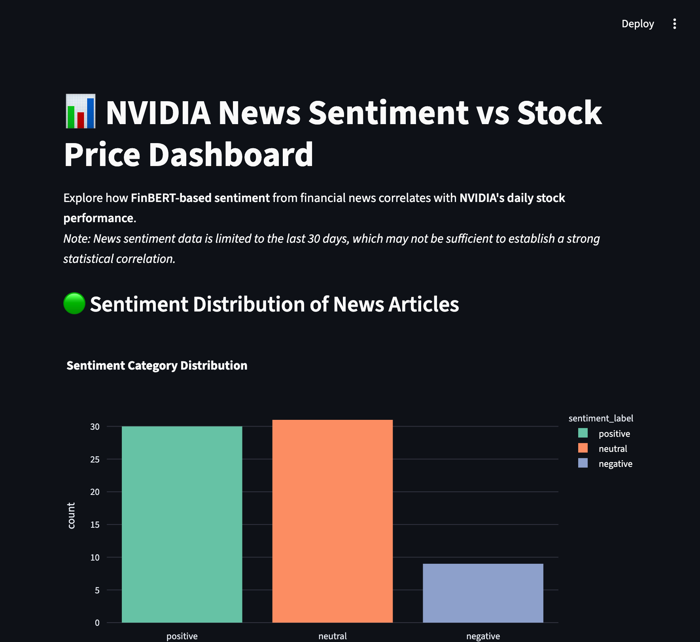

# 📊 NVIDIA Stock Prediction & Sentiment Analysis using LSTM + FinBERT

## 🧩 Project Description  
This project combines historical stock‐price data of NVDA (NVIDIA Corporation) with financial‐news sentiment derived via FinBERT. A Long Short-Term Memory (LSTM) neural network predicts the stock’s closing price, while the sentiment pipeline provides insight into how news may impact market movement. The architecture includes data preprocessing, model training, inference API, and interactive dashboards — making it **deployment‐ready**.

---

### 🎯 Objectives  
- Gather and preprocess NVIDIA stock data and financial‐news sentiment.  
- Train an LSTM model to predict NVIDIA closing prices.  
- Use FinBERT to compute sentiment scores from news headlines and integrate as a feature.  
- Build a REST API (using FastAPI) for model inference.  
- Provide interactive dashboards (via Streamlit) for visualization.  
- Containerize the application with Docker for streamlined deployment.

---

### ⚙️ Workflow  
1. **Data Preprocessing:**  
   - Load historical stock data for NVIDIA.  
   - Clean and convert raw data (date conversion, numeric casting, missing values).  
   - Load news headlines, compute daily sentiment with FinBERT, merge with stock data.  
2. **Model Building:**  
   - Define and train an LSTM network on past closing prices (and optional sentiment features).  
   - Scale numeric features using a standard scaler.  
3. **Model Evaluation:**  
   - Compute metrics: RMSE (Root Mean Square Error), MAE (Mean Absolute Error), R² Score.  
   - Visualize actual vs. predicted performance.  
4. **API Development:**  
   - Implement endpoints for stock price prediction and sentiment data retrieval.  
   - Deploy as a FastAPI service.  
5. **Containerization:**  
   - Build Docker image encapsulating API and dashboards.  
   - Expose ports for API and dashboards, enabling easy deployment.  
6. **Visualization & UI:**  
   - Dashboard for stock prediction: actual vs predicted, time‐series view.  
   - Dashboard for sentiment & stock price: visualizing correlation and sentiment overlay.

---

### 🚀 Key Features  
- End‐to‐end **ML pipeline** from data ingestion to deployment.  
- **LSTM model** for time‐series forecasting of NVIDIA’s stock price.  
- **FinBERT‐based sentiment analysis** applied to financial news.  
- **FastAPI backend** for real‐time inference.  
- **Dockerized architecture** for portability and production readiness.  
- **Interactive dashboards** for exploration of predictions and sentiment impact.  
- Ready for future **CI/CD integration and cloud deployment**.

---

## 🛠 Tech Stack Used  

### 💻 Programming & Database  
- **Languages:** Python  

### 🧠 Machine Learning & Data Science  
- **Libraries:** TensorFlow | Keras | Pandas | NumPy | Scikit‐learn  
- **Visualization:** Matplotlib | Plotly | Streamlit  

### 🐳 Deployment & DevOps  
- **Tools:** FastAPI | Docker | GitHub Actions  

### 🧰 Development  
- **IDEs & Tools:** VS Code | Jupyter Notebook  

---

## 🖥 Sentiment UI Preview  
<p align="center">  
    
</p>

---
## Stock Prediction Preview
<p align="center">
  
</p>
## 🚀 Run Locally  

```bash
# Clone this repository
git clone https://github.com/Kaushal-001/Stock-Price-Modeling-for-NVIDIA-Using-LSTM-with-FinBERT-Based-Sentiment-Scoring.git

# Navigate to the folder
cd Stock-Price-Modeling-for-NVIDIA-Using-LSTM-with-FinBERT-Based-Sentiment-Scoring

# Build Docker image
docker build -t nvidia-stock-app .

# Run the container
docker run -p 8000:8000 -p 8502:8502 -p 8503:8503 nvidia-stock-app
